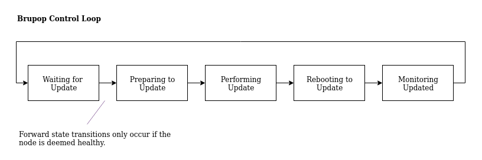

# Kubernetes Update Operator v0.2.0

## Abstract

Bottlerocket updates are applied to existing hosts via local Bottlerocket API calls, and require the system to reboot.
Customers who maintain Kubernetes clusters of Bottlerocket nodes can use the bottlerocket-update-operator (Brupop) to automatically coordinate the application of updates across their clusters in a manner that minimizes disruption to ongoing workloads.
This document proposes an iteration of Brupop (0.1.x → 0.2.x), introducing architectural changes that will resolve issues with the current design and better allow us to respond to customer requests in the future.
In order to accomplish these goals, we will more appropriately utilize Kubernetes primitives to handle node state transitions and information retrieval.
These changes will ultimately solidify into the 1.0.0 release of Brupop.

## Motivation

The most significant blocker to adding additional functionality to Brupop currently is the complexity of the interactions between the main control loop (*controller*) component and the *agent* component which runs indefinitely on each Bottlerocket node in the cluster.
Several facets of the current arrangement are problematic.
Any coordination between the controller and agents occurs via message passing, transported over Kubernetes [annotations](https://kubernetes.io/docs/concepts/overview/working-with-objects/annotations/) and [labels](https://kubernetes.io/docs/concepts/overview/working-with-objects/labels/) on the relevant node.
This includes any information about the state of a given node, as well as coordination between the controller and nodes that is required to discover and perform updates.

* Node annotations and labels can become contentious in large clusters.
* The transport mechanism is not well suited to passing rich data from a node to the controller, which would be needed for features like emitting metrics from the controller that include state information about the fleet.
* The implementation of the current state machine is difficult to understand, largely due to the cooperative and concurrent design.

While simplifying Brupop’s architecture doesn’t directly resolve many open customer issues, it does provide a path forward for resolving many outstanding issues in a simpler, and likely more robust fashion.

## Solution Overview

Brupop will, by default, continue to rely on Bottlerocket’s client-side update API to determine when to perform an update on any given node — foregoing any complex deployment velocity controls, and instead relying on the wave system built in to Bottlerocket updates.
For customers with stateful workloads that require more control, or wish to prevent any changes to their fleet during certain time windows, we will allow customers to disable or enable Brupop via configuration changes.
This can later be extended to support more complicated update schedules.

Brupop utilizes Kubernetes’ cordon and [Drain APIs](https://kubernetes.io/docs/tasks/administer-cluster/safely-drain-node/) to prepare a host for updates.
Customers with disruption-sensitive workloads should utilize [PodDisruptionBudgets](https://kubernetes.io/docs/concepts/workloads/pods/disruptions/) (which can block `drain` calls that are deemed too disruptive) to ensure that the velocity of updates is not too aggressive for their workload.

Brupop will continue to utilize a DaemonSet of agents on each Bottlerocket node.
Each of these nodes will also behave as a control loop, operating solely on the target node.
Instead of having the independent controller and agent cooperate and pass messages via RPC, we will associate a [Custom Resource](https://kubernetes.io/docs/concepts/extend-kubernetes/api-extension/custom-resources/) (called BottlerocketShadow) with each Bottlerocket node containing status information about the node, as well as a desired state.
The `controller` will utilize state information in the `BottlerocketShadow` resource to determine what the desired state of the node should be, setting that desired state back into the `spec` of the `BottlerocketShadow` resource.
The agent on each host will be responsible for updating the `BottlerocketShadow` metadata, and driving the local system towards the desired spec set by the controller.

So, as before, each node in the system flows through a state machine.
The brupop controller can page through relevant nodes and determine its next action or check on the status of ongoing actions.
Any status information from the ongoing actions will be reflected in the custom resource associated with the node.
Brupop will utilize a second controller to periodically scan the cluster for new nodes which are labelled to be managed, and create the required Custom Resource, which will signal the primary controller to begin managing them.



In order to allow configuration of Brupop across the cluster, we will also associate a Custom Resource with the update operator itself.
This will allow us to surface basic status information and controls (e.g. for enablement of optional features, like integration with AWS AutoScaling groups to ensure update reboots do not result in node termination).

The Custom Resources associated with Brupop and each node that it manages will account for a total persistance of the state of the controller, which should allow the controller to be interrupted and restarted without issue.

Brupop will integrate with [Prometheus](https://prometheus.io/docs/instrumenting/clientlibs/) by exposing an HTTP endpoint from which Prometheus can gather metrics, allowing customers insight into the actions that the operator is taking.
The operator will expose metrics for state transitions, including the version of a node before and after the update takes place.

## Drawbacks

* This plan involves reimplementation of an existing product, the initial cost of which will not provide immediate benefit.
* Existing customers will need to be provided a migration path to using the new update operator.
We can mitigate this somewhat by utilizing the same labeling system for selecting nodes to manage as is currently used.
(and of course, discussing the change publicly on github.)

## Rationale and Alternatives

### Improved Use of Annotations & Labels

We could invest in improving the ergonomics of working with the current Brupop message passing service.

**Modelling Behavior as Behavior Trees**

Modelling the actions taken by the DaemonSet agent and the controller as [behavior trees](https://en.wikipedia.org/wiki/Behavior_tree_(artificial_intelligence,_robotics_and_control)) could help simplify the code in Brupop such that iteration on the design would be easier, as the state machines in the current design are very difficult to understand.
This wouldn’t improve the message passing medium, and would still require an agent running on each Bottlerocket host.
In terms of effort, significant portions of the Brupop code would need to be refactored or rewritten.

**Simplifying the State Machines**

One option would be to attempt to simplify Brupop’s current state machine such that the structure of the machine is clear by reading data in the source code, and deriving operation of the system from the declarative description.
While this would make it simpler to add features to the existing system, we would still rely on annotations and labels to propagate information.

### Prometheus for Visualization

The [Prometheus](https://prometheus.io/) project is a [CNCF-graduated](https://github.com/cncf/toc/blob/main/process/graduation_criteria.adoc) monitoring solution for cloud-native applications.
Prometheus’ status in CNCF and popularity with Cloud-native customers means that Kubernetes cluster operators will likely be familiar with operating  Prometheus in their clusters, and will be familiar with how to monitor the Prometheus endpoint exposed by Brupop.
Indeed, [customers asking for improved observability](https://github.com/bottlerocket-os/bottlerocket-update-operator/issues/57) have mentioned Prometheus integration directly.
Alternatives to Prometheus include:

* Integration with an AWS Service like CloudWatch
    * Unfavorable, as we’d like to support Kubernetes clusters outside of AWS just as much as those within.
* Expose logs to a service that we spin up within the customer’s cluster, like Kibana.
    * Spinning up our own visualization frontend is a waste of our customers’ resources, especially if they are already using their own visualization frontend, like Prometheus.
* Exposing logs through a custom API from the Brupop controller.
    * Offering our own metrics API for customers to scrape means they must build their own components to handle those metrics and ingest them into their own systems. This seems like a strictly worse option than Prometheus integration

## Appendix

### Appendix A. State Transitions, Error Cases

Many things can go wrong while scheduling update.
In some cases, poor node health may indicate the need to wait till late.
If a problem seems to be indicative of a botched update, we will want to cease operation of the update agent until an operator can resolve the issu.
Further still, it may be possible via use of the Kubernetes `drain` API to enter a stuck state (see [“stuck evictions”](https://kubernetes.io/docs/tasks/administer-cluster/safely-drain-node/#stuck-evictions) and [examples in the PodDisruptionBudget documentation](https://kubernetes.io/docs/concepts/workloads/pods/disruptions/#pdb-example)).

To prevent nodes from becoming stuck during draining, we should default to draining a minimal set of nodes at a tim.
To begin with, we could restrict the tool to only draining/updating a single node in sequenc.
This could be configurable to update a minimal set or percentage, though operators should be directed to the risks of stuck nodes in the documentation.

Before any node is operated on, Brupop should analyze the health of the node by checking the state of existing Pod.
If Pods are unhealthy, Brupop can delay action on that node to a later tim.
Presumably this would be a transient error, although it could ultimately mean that Brupop becomes stuck due to a small set of unhealthy node.
Prometheus metrics should make it possible to diagnose such problems.

Nodes returning to the cluster should be watched for a set time interval to ensure that work returns to the nodes and remains health.
If Pods on such nodes do not appear to start successfully, we should freeze Brupop’s operatio.
An operator must decide if the new Bottlerocket update is negatively impacting their fleet.

### Appendix B. Detailed Reference: Lifecycle of Kubernetes Objects

Any resources created in the Kubernetes cluster by Brupop must be properly terminated so as to not exert undue pressure on the cluste.
In particular, Custom Resources and Job objects must be properly terminated when they are no longer needed.

**Custom Resources**
Custom Resource cleanup for the per-node custom resources will have `ownerReference`s associating the resource with the node that it describes, e.g.:

```
metadata:
  name: ip-192-168-48-253.us-west-2.compute.internal
  ownerReferences:
    - apiVersion: v1
      kind: Node
      uid: c5a4b820-39a6-46e8-9a2f-a2623a17dfbf
      name: ip-192-168-48-253.us-west-2.compute.internal
```

Kubernetes will garbage collect these custom resources when the associated node is removed from the cluster.

### Appendix C. Authorization of Bottlerocket Node Behavior
Usage of the usual kubernetes [rbac](https://kubernetes.io/docs/reference/access-authn-authz/rbac/) system for authorization will lead to a situation in which any Bottlerocket node will have sufficient permissions to modify the BottlerocketShadow custom resource for any other node, as a role would be shared by all pods.
In order to authorize custom resource updates, each DaemonSet pod will utilize [Service Account Token Volume Projection](https://kubernetes.io/docs/tasks/configure-pod-container/configure-service-account/#service-account-token-volume-projection) to receive a token which uniquely identifies that pod.
Update requests for BottlerocketShadow custom resources will be sent to the Brupop controller via a web API, in which the kubernetes TokenReview will be used to validate the token.
The controller will check that the calling pod resides on the node associated with the target custom resource before making the requested update.

In order to handle requests from each Bottlerocket node with high availability, the Brupop controller will need to run with multiple replicas, using leader election to determine which node will be responsible for orchestrating node updates.
