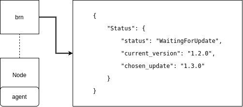

<!-- _class: lead invert -->

## Bottlerocket Update Operator (Brupop)

---

## What is Brupop?

* A Kubernetes *Operator* (or *Controller*)
* Orchestrates Bottlerocket updates across your fleet

---

## k8s Controllers, in a Nutshell

* Non-terminating loop that regulates state
* Objects have:
    * Spec: Desired state
    * Status: Current state
* Controllers drive state to an outcome

---

## Birds-Eye View of Brupop Architecture

* Nested control loops
* Control loop to drive updates for individual node (*`agent`*)

* Control loop to orchestrate updates across fleet  (*`controller`*)

---

## `BottlerocketNode` Custom Resource
* k8s uses a declarative API
    * Create objects describing state and add them to the cluster
* Custom Resources -- Manage your own objects with k8s APIs!
* Update status of each k8s `Node` running Bottlerocket is tracked in a "shadow" custom resource
* `BottlerocketNode` or `brn` for short

---

### `BottlerocketNode` Custom Resource

---

## *`controller`* Component
* All state derived from k8s API during each loop
* Uses the `status` of all `brn`s to determine state
* Sets `spec` of `brn`s to drive updates
* One update at a time (for now)

---

## *`controller`* Component
* k8s `watch` functionality
    * Long-polling to get all updates to an object or list of objects
    * Controller runtimes (like `kube-rs`) provide abstractions to squash `watch` events into a cache
* The controller uses a `watch` + `Store<BottlerocketNode>`
    * Efficiently keep a up-to-date reference to all `brn` in memory

---

## *`controller`* Component
* Control Loop:
    * Use in-memory cache to determine *active* `brn` set
    * Check to see if active `brn` have reached desired state
    * Any that have get the next state in `spec`
    * If no active `brn`, check inactive for any which are ready to update and *activate* one by pushing it forward

---

## *`agent`* Component
* All state derived from k8s & Bottlerocket APIs
* Gathers OS info & updates `brn.status`
* Uses `brn.spec` to decide when to update
* Drain k8s Pods & cordon Node prior to reboot

---

## *`agent`* Component
* Control Loop
    * Create shadow `brn` object if needed
    * Check current `spec` and `status`
    * If they differ, perform needed action to move forward
    * Gather update information from Bottlerocket API
    * Update `brn` object with current `status`

---

## *`apiserver`* Component
* k8s uses role-based authN/authZ
* All brupop `agent`s have the same role
    * This means they can modify `brn` objects for other nodes!
* Solution: channel `brn` writes through a priveleged web API
* guarantees requests are coming from the associated k8s `Node` using k8s `token` API
* Only the `agent`s consume the `apiserver`
